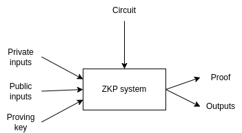
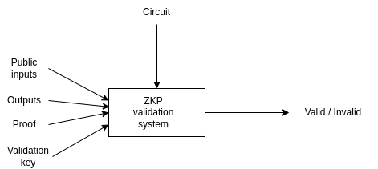
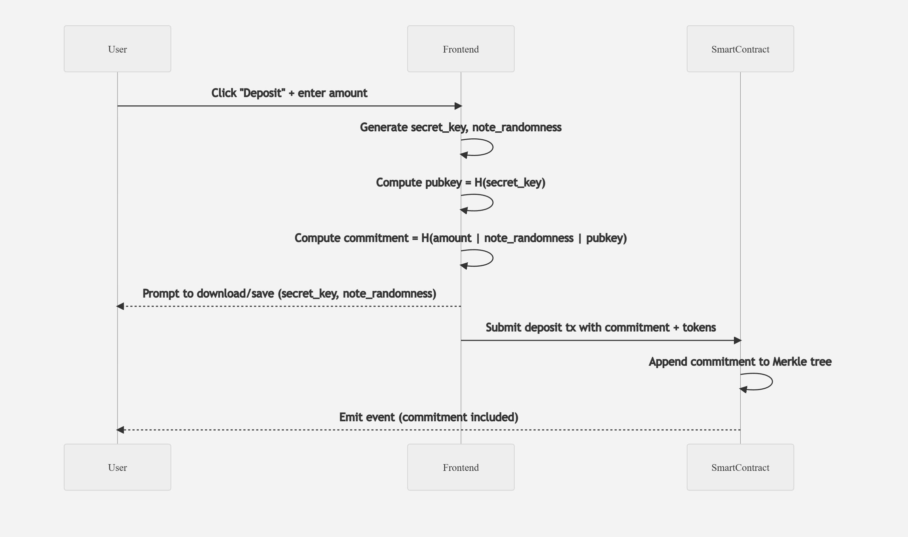
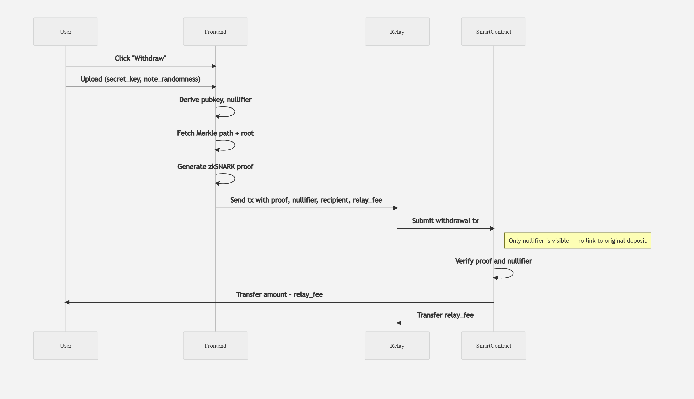

# 🔐 Introducing CipherPay: Private Payments with ZK on Solana

**CipherPay** is a zero-knowledge-based mixer that allows users to deposit, transfer, and withdraw tokens privately — using zkSNARKs to ensure anonymity while maintaining on-chain verification. In this post, we’ll break down how it works from the ground up.
---


## 🧠 How Zero-Knowledge Proofs Work





At the core of CipherPay is a simple idea: you can prove something is true **without revealing the underlying data**.

#### 🧩 How it works:

* **Prover**: Knows a secret (e.g., a note’s randomness and secret key).
* **ZK circuit**: A program that checks whether public and private inputs satisfy predefined constraints.
  For example, it can:

  * Verify a Merkle proof is valid
  * Check that `hash(secret) = public_key`
  * Confirm that input and output amounts balance
* **Verifier**: Checks the resulting proof using only public inputs, without learning any private data.

CipherPay uses this model to allow users to **spend notes** without revealing which deposit they’re spending or how much they control.

## 🔐 Notes and Commitments

Each private balance in CipherPay is represented as a **note**, which is just a commitment to an amount, recipient, and some randomness.

### 💡 How a Note is Constructed

```txt
Note:
    amount: u256
    note_randomness: u256
    pubkey: H(secret_key)

Commitment: 
    C = H(amount | note_randomness | pubkey)
```

### 🌲 What is a Merkle Tree and Why It Matters

A **Merkle tree** is a cryptographic data structure that allows you to prove that a piece of data is included in a set.

CipherPay uses a Merkle tree to store **note commitments** on-chain.

#### 💡 Why?

When a user deposits into the mixer, a commitment `C` is generated and added to the Merkle tree.

Later, during withdrawal, the user includes a **Merkle proof inside a zero-knowledge proof** to show that `C` is part of the current Merkle root — **without revealing which commitment it was**.

This provides:

* ✅ Efficient verification — only a single Merkle root needs to be stored on-chain
* 🛡️ Privacy — no one sees which deposit is being spent

> 📌 The Merkle proof is not submitted directly to the contract.
> Instead, the ZK circuit verifies it privately, and only the root is public.

---

### 📦 Visual Example

```
          Root
         /    \
      H0       H1
     /  \     /  \
   C0   C1  C2   C3
```

If your note is `C1`, you only need to provide:

* A Merkle path: `[C0, H1]`
* Inside the ZK circuit

This proves `C1` is part of the tree — **without revealing that it’s `C1`**.

## 🔁 What Is a Nullifier and How It Prevents Double-Spending

To ensure each note can only be spent once, CipherPay introduces a **nullifier** — a cryptographic fingerprint derived from the note's secret.

```txt
nullifier = H(secret_key | note_randomness)
```

This value is:

* 💯 **Unique** to each note
* ❌ **Unlinkable** to the original deposit (because `secret_key` and `note_randomness` are never revealed)
* ✅ **Publicly stored** on-chain *after spending*, to prevent reuse

### 🔐 How It Works in Practice

1. When withdrawing, the user computes the nullifier and includes it in the ZK proof.
2. The ZK circuit proves:

   * That this nullifier was derived correctly
   * That the corresponding commitment existed in the Merkle tree
3. The smart contract:

   * Stores the nullifier
   * **Rejects any future transaction** attempting to reuse it

> 🔎 No one can link the nullifier to a specific commitment.
> It simply acts as a **"this note has been spent" flag**, without revealing which one.

---

## 🪙 Depositing into CipherPay

Let’s see how deposits work.

### 🖼️ Deposit Flow



## 💸 Withdrawing Privately

Withdrawals require proving you own a note inside the Merkle tree — **without revealing which one**.

### 🖼️ Withdrawal Flow



### 🔐 What the Proof Shows

* The note `C` is in the tree.
* The nullifier has never been used.
* The amount matches the deposit (minus fees/change).
* The spender owns the secret key.

## 🛡️ CipherPay Security Model

* No public links between sender and recipient
* Arbitrary deposit and withdrawal amounts
* No risk of note reuse (nullifiers prevent this)
* Everything verified on-chain via zero-knowledge proof

---

## 🔭 What’s Next?

CipherPay starts with **Product 0: basic deposit + withdrawal**, but will grow to support:

* ✅ Multi-input, multi-output withdrawals
* ✅ P2P encrypted payments
* 🧪 AMMs with shielded swaps
* 🧪 Private voting + identity integration

